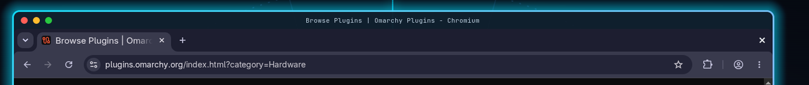

# Cupertino

macOS-style windows for [Omarchy](https://omarchy.org) — traffic-light title
bars, drag to move, edge resize, half-screen snapping, and a minimize you can
actually find again.



## What you get

- **Traffic lights on every window** — red closes, yellow minimizes, green
  zooms. Left-aligned, with the glyphs appearing on hover, like macOS.
- **Drag the title bar** to move a window; **double-click** it to zoom.
- **Drag any edge or corner** to resize, with no modifier key held.
- **Minimize that is visible** — minimized windows become clickable chips in
  the bar instead of vanishing. Click a chip to bring the window back.
- **Split screen on the arrow keys**, the same ones Windows uses. `SUPER + ←`
  takes the left half; follow it with `SUPER + ↑` and the window becomes the
  top-left quarter, so four apps tile one workspace with two presses each.
  Geometry comes from the real monitor and the bar's reserved area, so halves
  meet with no gap at any resolution, scale, or bar position.
- **Magnetic dragging** — a dragged window sticks to screen edges and to other
  windows as it gets close, so things line up without pixel-hunting.
- **Floating windows** by default, centered on open, remembering their size.
- **Follows your theme** — the title bar and the focused-window glow are tinted
  from the active Omarchy theme's colors, and retrack when you switch themes.

## Install

```bash
git clone https://github.com/<you>/omarchy-cupertino.git
cd omarchy-cupertino
./install.sh
```

The bar widget half can also be installed straight from the marketplace:

```bash
omarchy plugin add https://github.com/<you>/omarchy-cupertino.git --enable
```

That gives you the health widget, which will then offer to run `install.sh`
for the title bars themselves.

The installer builds the title-bar plugin against your exact Hyprland build,
installs the minimize widget, patches `~/.config/hypr/hyprland.lua` (keeping a
timestamped backup), and reloads.

## Requirements

- Omarchy 4.x with the Quickshell shell (Quickshell >= 0.3.0)
- Hyprland in **Lua** configuration mode
- `g++`, `git`, `pkg-config` for building the title-bar plugin

## Keys

| Key | Action |
| --- | --- |
| `SUPER + ←/→/↑/↓` | Snap to that half — press twice across axes for a quarter |
| `SUPER + \` | Snap to the full screen |
| `SUPER + SHIFT + \` | Center the window |
| `SUPER + SHIFT + CTRL + ←/→/↑/↓` | Move focus between windows |
| `SUPER + M` | Minimize the focused window to the shelf |
| `SUPER + T` | Tile the focused window (float is the default here) |
| `SUPER + W` | Close the focused window |

## After a Hyprland update

Hyprland plugins are compiled against one exact Hyprland build, so an update
that bumps Hyprland makes the title bars stop appearing. Nothing else breaks
and login is never blocked. Get them back with:

```bash
rebuild-hyprbars
```

## A note on `hyprctl dispatch`

Omarchy configures Hyprland in Lua, so `hyprctl dispatch` takes a Lua
expression. The old form fails **silently** — a button wired that way looks
fine and does nothing:

```bash
hyprctl dispatch fullscreen 1                                   # no-op
hyprctl dispatch 'hl.dsp.window.fullscreen({ mode = "maximized" })'   # works
```

## Uninstall

```bash
./uninstall.sh
```

Minimized windows are restored to your current workspace first.

## What the bar widget does

The title bars are drawn by a **compiled** Hyprland plugin, which is tied to
the exact Hyprland build it was compiled against. An update that bumps
Hyprland makes the bars silently stop appearing — nothing errors, they are just
gone, and the reason is not obvious.

The Cupertino widget watches for exactly that. It stays hidden while everything
works, and shows a single glyph with a one-click fix when it doesn't.

## Built on

This project is the integration layer. The heavy lifting belongs to:

- **[hyprbars](https://github.com/hyprwm/hyprland-plugins)** by Vaxry
  (BSD-3-Clause) — draws the title bars. Built from the commit that
  `hyprpm.toml` pins to your Hyprland version.
- **[omarchy-minimize](https://github.com/gardnmi/omarchy-minimize)** by Mike
  Gardner (MIT) — the bar chips for minimized windows. Installed as a
  dependency, not vendored.

Neither is redistributed here; the installer fetches both from their own
sources.

## License

MIT — see [LICENSE](LICENSE).
